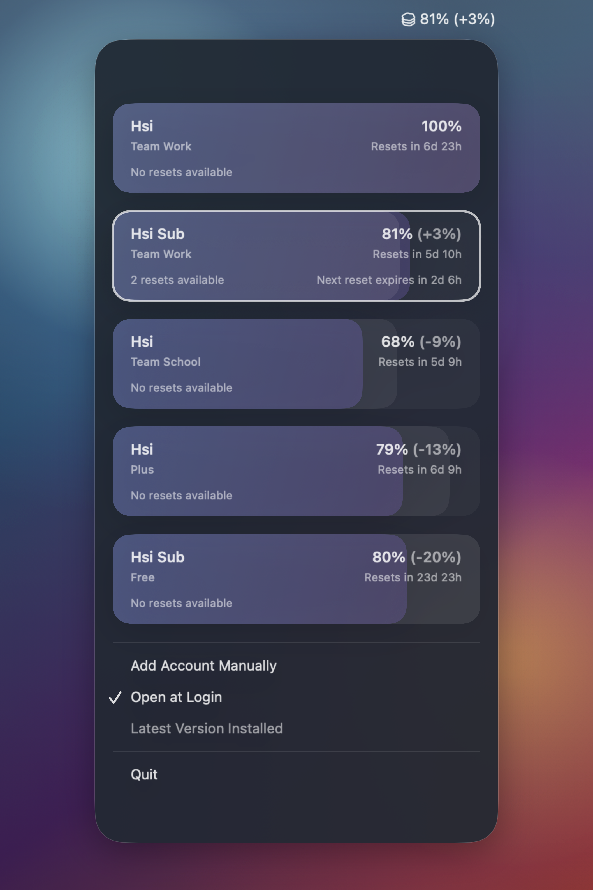

<div align="center">
  

<h1>Comux</h1>

A macOS menu bar app to track and sort your Codex account limits at a glance.


</div>

## Why Comux

- **Zero Setup:** Picks up local Codex sessions automatically and refreshes usage in the background, no manual setup required.
- **Zero-Click 5h Usage:** See your active account's 5-hour usage directly beside the menu bar icon before opening anything.
- **Unified Tracking:** See usage across multiple Codex accounts and workspaces in one menu bar view, without bouncing between sessions.
- **Plan your Usage:** Accounts are ranked by remaining headroom, making it obvious which account to use next.
- **Privacy First:** Keep account details readable without exposing more than you need. Comux supports custom display names and stores account metadata locally in a native on-disk SQLite database, so your account inventory stays private, durable, and under your control.

## Install

### Requirements
- macOS 14+ (Sonoma)

### GitHub Releases
Download: <https://github.com/Hsiii/Comux/releases>

### Homebrew
```bash
brew install --cask Hsiii/tap/comux
```

### First run
- Keep Codex signed in locally; Comux reads existing Codex session state.
- Open Comux from Applications and use the menu bar item to review accounts and workspaces.
- Optional: rename accounts in Comux when you want private or easier-to-scan labels.

## Development

Build a local DMG:

```bash
sudo xcode-select -s /Applications/Xcode.app/Contents/Developer
brew install xcodegen
make dmg
```

Local builds are ad-hoc signed unless `COMUX_CODE_SIGN_IDENTITY` is set to a Developer ID Application identity.

Run directly:

```bash
swift run comux
```

Build the native macOS app bundle:

```bash
make build
```

Build a DMG for distribution:

```bash
make dmg
```

## Release

Run the release wrapper:

```bash
./scripts/release.sh 0.1.0
```

It publishes a GitHub release, waits for the `Release` workflow, builds `comux-<version>.zip`, notarizes it when Apple credentials are configured, uploads the generated cask, and updates the Homebrew tap configured by `HOMEBREW_TAP_REPOSITORY`.

Required repository secrets for signed and notarized releases:

- `APPLE_DEVELOPER_CERTIFICATE_P12_BASE64`
- `APPLE_DEVELOPER_CERTIFICATE_PASSWORD`
- `APPLE_KEYCHAIN_PASSWORD`
- `APPLE_NOTARY_APPLE_ID`
- `APPLE_NOTARY_TEAM_ID`
- `APPLE_NOTARY_PASSWORD`
- `HOMEBREW_TAP_TOKEN`

Required repository variable:

- `HOMEBREW_TAP_REPOSITORY`, for example `Hsiii/homebrew-tap`
